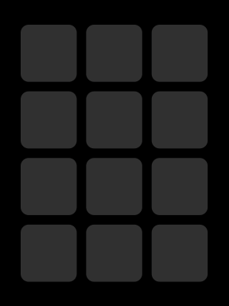
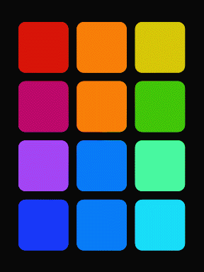
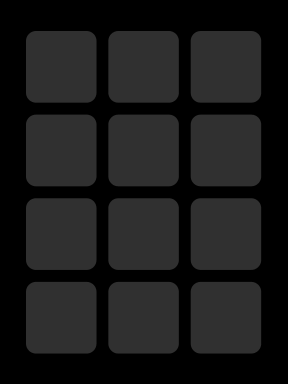
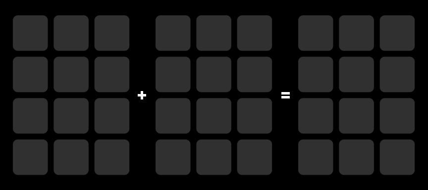
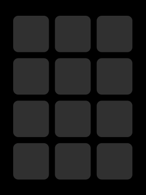

# Animations

The following animation types should be supported by Xebow.

### Continuous

A continuous animation runs indefinitely. This type of animation can act as an environmental effect.

Example: A chase sequence

Example: A rotating pinwheel of colors

### One-Shot

A one-shot animation has a distinct end to the animation. This type of animation can serve as feedback for an action that has been performed, like a button press.

Example: A burst centered on a button that was pressed

### Combining Animations

Combining animations allows for a new animation to start without interrupting any other animations in progress. This can be used to blend any of the animation types together, like blending one-shot animations together to illustrate multiple events occurring, blending continuous animations together to morph environmental effects, or blending one-shot and continuous animations together to display feedback without interrupting an environmental effect.

Example: Two continuous animations blended together

Example: Two one-shot animations blended together when two different keys are pressed

## Parameters

The following parameters are independent of an animation's implementation and are applied as modifiers. This allows an animation to be varied at runtime rather than needing to implement a new animation for each variant. For example, if a monochromatic animation is implemented, it could derive its hue from one of these parameters to render the same animation sequence in various colors without the need to modify the implementation for each variant. This could also allow a dynamic color shift to happen in the middle of an animation.

Any of these parameters can be adjusted dynamically at runtime to vary the animations. The user can adjust these parameters if they are mapped to user input.

*Note: These names are currently conceptual and can be renamed when implemented.*

- **Base Hue** - The hue used as the starting point for an animation. For a monochromatic animation this would be the hue that the shades and tints are based on. For an animation that contains multiple colors, this value may be the starting hue that other colors are offset from.
- **Playback Speed** - A scaling factor that speeds up or slows down an animation relative to its implementation's speed.
- **Offset** - Reposition the center point of an animation along the X and/or Y axis.
