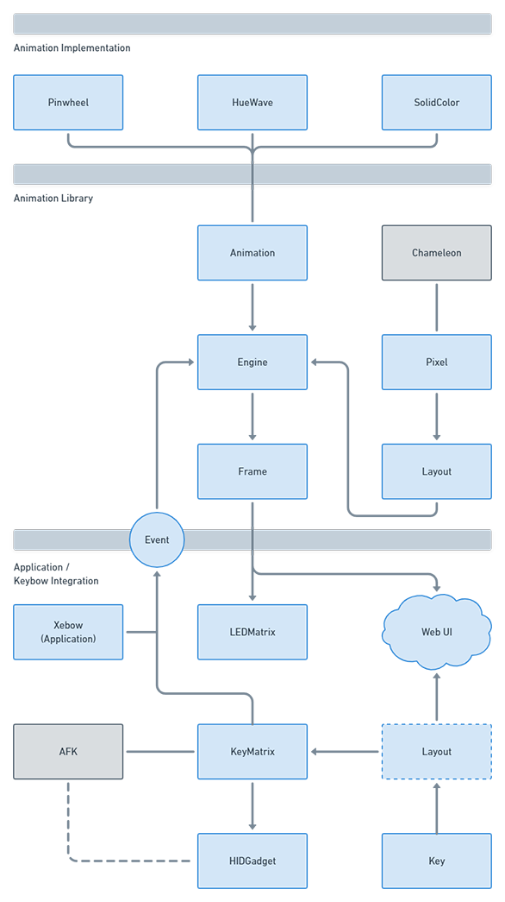

# Component Flow

This source diagram is here:\
https://whimsical.com/Df4WZWgWZZo8kncGcxhGXq

# Components

The following sections are the high level system domains, each containing a set of components.

## Animation Implementation

Potential namespace: `Animation.Implementation`

This is where all of the implemented animations that are part of the animation library reside. Once the animation namespace is separated into a standalone library, these are the animations that will come along with the library. Therefore, it should also be considered that non-standard (user-created) animations should NOT reside in this library namespace and that we should consider a recommended user namespace as well (i.e. `<project>.Animation.<name>`).

## Animation Library

Current namespace: `RGBMatrix`\
Potential namespace: `<Library name>`

The animation library namespace is intended to be separated out from the Xebow project and into a dedicated library. Due to this, we should avoid components in this namespace depending on components in the application namespace.

#### Animation

Responsibilities:
- Common data representation for animations (`%Animation{}`)
- Interface for the application to instantiate/use animations for the project
- Interface for the engine to render animations
- Potential wrapper for how animations are stored (i.e. ETS table for animation config)
- Helpers to build animation implementations
- Animation implementation configuration (`%Config{}`)

Thoughts:
- Do we need to separate out the macros for implementing animations (`use Animation`) from the struct and functions that help to process animations?
- *This module may have too many responsibilities - consider decomposition*

#### Engine

Renders animations, generating frames of pixels as output. Also handles the transport controls (i.e. play, stop, pause).

#### Event

Events can be sent to the engine and propagated to a handler in an animation implementation. This allows for an animation implementation to react based on user or system input.

#### Frame

A group of pixels with color values.

#### Layout

An arrangement of items in 2D space.
This can be used to describe key and LED positions.

#### Pixel

An item that can be illuminated.

## Application / Keybow Integration

This part of the system is targeted at running the Keybow as a Nerves-based mechanical keyboard.

#### Key

A key on a keyboard.

Notes:
- This sounds generic and may be in the wrong place. AFK candidate?

#### Keyboard

The logical functionality of a keyboard. It accepts physical or emulated events of keys being pressed/released, handles keyboard state, and outputs keyboard events (like triggering HID reports).

#### KeyMatrix

The Keybow's key matrix.

#### HIDGaget

Keybow USB communication.

#### LEDMatrix

The Keybow's LED matrix.

#### Web UI

The Phoenix Live View application for the Xebow web interface.

#### Xebow

Application logic & glue code.
